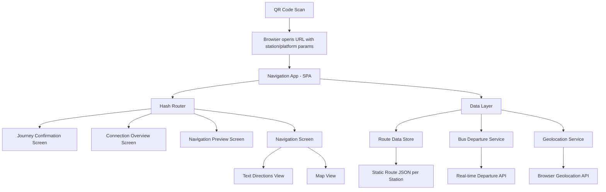
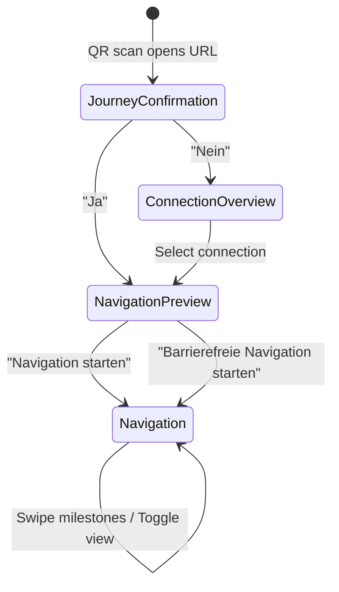

# Design Document: Rail Replacement Navigation

## Overview

This design defines a mobile-first web application that guides train passengers from their platform to the rail replacement bus stop during service disruptions. The app is a lightweight, installationless PWA-style experience triggered by QR code scanning.

**Key Design Decisions:**

- **Vanilla Web Components + DB UX Design System**: Uses `@db-ux/wc-core-components` for UI consistency with Deutsche Bahn's brand, avoiding framework overhead for fast initial load.
- **Static Site with Client-Side Routing**: Single HTML entry point with hash-based routing for screen transitions — no server-side rendering needed for this use case.
- **Offline-First Navigation Data**: Route milestones and photos are pre-loaded on initial page load so navigation works even with spotty underground connectivity.
- **Geolocation API for Map View**: Uses the browser's native Geolocation API only when the user opts into the map view.
- **Leaflet for Map Rendering**: Lightweight open-source map library with OpenStreetMap tiles — no API keys required.

## Architecture



### URL Structure

The QR code encodes a URL with query parameters:

```
https://{domain}/?station={stationId}&platform={platformId}
```

The app reads these on load and uses them to fetch the appropriate route data and pre-fill the journey confirmation screen.

### Screen Flow



## Components and Interfaces

### Screen Components

| Component | DB UX Components Used | Responsibility |
|-----------|----------------------|----------------|
| `JourneyConfirmationScreen` | `db-card`, `db-button`, `db-icon` | Shows train info, presents Ja/Nein choice |
| `ConnectionOverviewScreen` | `db-card`, `db-stack`, `db-notification` | Lists active replacement connections |
| `NavigationPreviewScreen` | `db-card`, `db-button`, `db-badge` | Shows route summary, start buttons, departure info |
| `NavigationScreen` | `db-tabs`, `db-tab-item`, `db-icon` | Active navigation with milestone cards and map |

### Internal Components (Custom)

| Component | Responsibility |
|-----------|----------------|
| `MilestoneCard` | Displays one navigation step: photo, direction arrow, distance, description |
| `DotIndicator` | Shows pagination dots for milestone progress |
| `BusDepartureInfo` | Real-time departure times widget |
| `DirectionArrow` | SVG arrow rotated to indicate walking direction |
| `MapViewComponent` | Leaflet map with current position, route, and exit marker |
| `SwipeContainer` | Horizontal swipe gesture handler for milestones |

### Interfaces

```typescript
interface StationRoute {
  stationId: string;
  stationName: string;
  platformId: string;
  connections: Connection[];
  routes: {
    standard: Milestone[];
    accessible: Milestone[];
  };
}

interface Connection {
  id: string;
  trainNumber: string;
  routeName: string;
  destination: string;
  departureTime: string;  // ISO 8601
  busStop: string;
  disruption: string;
}

interface Milestone {
  id: number;
  instruction: string;        // e.g., "Treppe runter zu Gleis 3"
  direction: Direction;       // compass direction for arrow
  distanceMeters: number;     // distance to next milestone
  photoUrl: string;           // path to landmark photo
  accessibilityFeature?: AccessibilityFeature;  // only for accessible routes
}

type Direction = 'north' | 'south' | 'east' | 'west' | 'northeast' | 'northwest' | 'southeast' | 'southwest' | 'up' | 'down';

type AccessibilityFeature = 'elevator' | 'ramp' | 'level-crossing' | 'tactile-paving';

interface BusDeparture {
  departureTime: string;  // ISO 8601
  destination: string;
  busStop: string;
  isRealtime: boolean;
}

interface NavigationState {
  currentScreen: Screen;
  selectedConnection: Connection | null;
  navigationMode: 'standard' | 'accessible';
  currentMilestoneIndex: number;
  milestones: Milestone[];
  busDepartures: BusDeparture[];
  geolocationPermission: 'granted' | 'denied' | 'prompt';
  activeView: 'text' | 'map';
}

type Screen = 'confirmation' | 'connections' | 'preview' | 'navigation';
```

### Router Interface

```typescript
interface Router {
  navigate(screen: Screen, params?: Record<string, string>): void;
  getCurrentScreen(): Screen;
  getParams(): Record<string, string>;
  onRouteChange(callback: (screen: Screen) => void): void;
}
```

### Services

```typescript
interface RouteDataService {
  getStationRoute(stationId: string, platformId: string): Promise<StationRoute>;
  getMilestones(stationId: string, connectionId: string, mode: 'standard' | 'accessible'): Milestone[];
}

interface DepartureService {
  getDepartures(stationId: string): Promise<BusDeparture[]>;
  subscribeToUpdates(stationId: string, callback: (departures: BusDeparture[]) => void): () => void;
}

interface GeolocationService {
  requestPermission(): Promise<'granted' | 'denied'>;
  getCurrentPosition(): Promise<{ lat: number; lng: number }>;
  watchPosition(callback: (pos: { lat: number; lng: number }) => void): () => void;
}
```

## Data Models

### Route Data (Static JSON per Station)

Route data is served as static JSON files, one per station. This keeps the architecture simple and allows offline caching.

```
/data/routes/{stationId}.json
```

Example structure:

```json
{
  "stationId": "FFM-HBF",
  "stationName": "Frankfurt (Main) Hbf",
  "platformId": "7",
  "connections": [
    {
      "id": "conn-1",
      "trainNumber": "RE 50",
      "routeName": "Frankfurt - Mannheim",
      "destination": "Mannheim Hbf",
      "departureTime": "2025-06-15T14:30:00+02:00",
      "busStop": "Bussteig A3",
      "disruption": "Streckensperrung zwischen Frankfurt Süd und Darmstadt"
    }
  ],
  "routes": {
    "standard": [
      {
        "id": 1,
        "instruction": "Treppe runter Richtung Ausgang Süd",
        "direction": "down",
        "distanceMeters": 30,
        "photoUrl": "/data/photos/FFM-HBF/step-1.jpg"
      },
      {
        "id": 2,
        "instruction": "Links abbiegen, dem Schild 'Ausgang Süd' folgen",
        "direction": "west",
        "distanceMeters": 80,
        "photoUrl": "/data/photos/FFM-HBF/step-2.jpg"
      }
    ],
    "accessible": [
      {
        "id": 1,
        "instruction": "Aufzug nehmen zu Ebene 0",
        "direction": "down",
        "distanceMeters": 15,
        "photoUrl": "/data/photos/FFM-HBF/acc-step-1.jpg",
        "accessibilityFeature": "elevator"
      }
    ]
  }
}
```

### Application State

The app uses a simple observable state store (no external state management library):

```typescript
class AppState {
  private state: NavigationState;
  private listeners: Set<(state: NavigationState) => void>;

  getState(): NavigationState;
  setState(partial: Partial<NavigationState>): void;
  subscribe(listener: (state: NavigationState) => void): () => void;
}
```

### Bus Departure Data (API Response)

```json
{
  "stationId": "FFM-HBF",
  "departures": [
    {
      "departureTime": "2025-06-15T14:30:00+02:00",
      "destination": "Mannheim Hbf",
      "busStop": "Bussteig A3",
      "isRealtime": true
    },
    {
      "departureTime": "2025-06-15T14:50:00+02:00",
      "destination": "Mannheim Hbf",
      "busStop": "Bussteig A3",
      "isRealtime": true
    }
  ]
}
```

### Map Data

The Map View uses:
- **Tile source**: OpenStreetMap via Leaflet
- **Exit marker coordinates**: Stored in the station route JSON as `exitLocation: { lat, lng }`
- **Bus stop coordinates**: Stored per connection as `busStopLocation: { lat, lng }`
- **Route polyline**: GeoJSON linestring stored in station route data

## Correctness Properties

*A property is a characteristic or behavior that should hold true across all valid executions of a system — essentially, a formal statement about what the system should do. Properties serve as the bridge between human-readable specifications and machine-verifiable correctness guarantees.*

### Property 1: URL Parsing Round Trip

*For any* valid station identifier and platform identifier, encoding them into a QR code URL and then parsing that URL back should produce the same station and platform identifiers.

**Validates: Requirements 1.2**

### Property 2: Malformed URL Rejection

*For any* string that does not conform to the expected URL format (missing station parameter, missing platform parameter, or invalid characters), the URL parser should return an error result and never produce a valid station/platform pair.

**Validates: Requirements 1.4**

### Property 3: Journey Confirmation Renders All Connection Fields

*For any* valid Connection object with trainNumber, routeName, and disruption, the Journey Confirmation Screen renderer should produce output containing all three field values.

**Validates: Requirements 2.1**

### Property 4: Connection List Completeness

*For any* non-empty array of Connection objects, the Connection Overview renderer should produce output that contains the destination, departure time, and bus stop for every connection in the array, with no connections omitted.

**Validates: Requirements 3.1, 3.3**

### Property 5: Navigation Preview Milestone Summary

*For any* array of Milestones, the Navigation Preview renderer should produce a summary that accounts for every milestone in the route (the count of rendered summary items equals the count of milestones).

**Validates: Requirements 4.1**

### Property 6: Next Departures Computation

*For any* non-empty array of BusDeparture objects and any current timestamp, the "next departures" computation should return departures ordered by time where all returned departures have a departure time strictly after the current timestamp, and the first returned departure is the earliest future departure in the array.

**Validates: Requirements 4.5, 5.4, 6.1, 6.2, 6.3**

### Property 7: Milestone Rendering Completeness

*For any* valid Milestone object, the Navigation Screen milestone renderer should produce output that includes the direction indicator, the distance value, and the landmark photo URL.

**Validates: Requirements 5.1**

### Property 8: Milestone Index State Transitions

*For any* milestone array of length N and any current index I (0 ≤ I < N), swiping forward should produce index min(I+1, N-1) and swiping backward should produce index max(I-1, 0).

**Validates: Requirements 5.2**

### Property 9: Dot Indicator Correctness

*For any* milestone array of length N and any current index I, the Dot Indicator should report total count equal to N and active position equal to I.

**Validates: Requirements 5.3**

### Property 10: Walking Distance and Duration Calculation

*For any* array of Milestones with positive distance values, the total walking distance should equal the sum of all milestone distances, and the estimated walking duration should equal the total distance divided by the assumed walking speed (approximately 1.2 m/s).

**Validates: Requirements 7.5**

### Property 11: Accessible Route Data Validity

*For any* accessible route milestone array, no milestone should contain stair or escalator instructions without an accessibility feature override, and at least one milestone in the route should have a non-null accessibilityFeature (elevator, ramp, or level-crossing).

**Validates: Requirements 8.1, 8.2**

### Property 12: Accessible Milestone Feature Label Rendering

*For any* Milestone with a non-null accessibilityFeature, the rendered output should contain a visible label indicating which feature (elevator, ramp, level-crossing, tactile-paving) is used at that step.

**Validates: Requirements 8.4**

## Error Handling

### URL Parsing Errors
- **Invalid QR code URL**: Display a German-language error screen with a message like "Der QR-Code konnte nicht gelesen werden" and a suggestion to try scanning again.
- **Missing station/platform parameters**: Same error screen — the user cannot proceed without valid route data.

### Data Loading Errors
- **Route JSON fetch failure**: Display a notification using `db-notification` with variant "error" indicating the route data couldn't be loaded, with a retry button.
- **Departure API failure**: Show scheduled departure times with a notice ("Echtzeitdaten nicht verfügbar") as per Requirement 6.4. Do not block navigation.

### Navigation Errors
- **Empty milestone array**: If a route has zero milestones (data error), show a notification and prevent navigation from starting.
- **Missing landmark photo**: Show a placeholder image with alt text describing the instruction. Do not block navigation progress.

### Geolocation Errors
- **Permission denied**: Show map without current position marker (per Requirement 10.3). Display route from station entrance to bus stop.
- **Position unavailable / timeout**: Show a brief notification that location couldn't be determined; continue showing map without live position.

### Network Connectivity
- **Offline after initial load**: If route data was loaded on first paint, navigation continues to work (milestone data is cached in memory). Departure updates will stop — show last known departure times with a stale data indicator.
- **Complete offline**: Show error screen suggesting the user find WiFi or try again when signal returns.

## Testing Strategy

### Unit Tests (Example-Based)

Unit tests cover specific interactions and edge cases:

- Screen navigation: Ja → Preview, Nein → Connections, select connection → Preview
- Button presence: exactly 2 buttons on confirmation, exactly 2 on preview
- Default view state: navigation starts in "Wegbeschreibung" mode
- Empty states: no connections → empty message, no departures → scheduled fallback notice
- Geolocation: permission denied → map without marker, permission granted → marker added
- German language: verify UI labels are in German
- Static structure: toggle has "Wegbeschreibung" and "Maps" options

### Property-Based Tests

Property-based tests verify universal properties with minimum **100 iterations** each using **fast-check** (JavaScript PBT library):

| Property | What's Generated | What's Verified |
|----------|-----------------|-----------------|
| 1: URL round trip | Random alphanumeric station/platform IDs | `parse(encode(id)) === id` |
| 2: Malformed URL rejection | Random strings without valid format | Parser returns error |
| 3: Confirmation rendering | Random Connection objects | Output contains all fields |
| 4: Connection list completeness | Random Connection arrays | All items rendered with all fields |
| 5: Preview milestone summary | Random Milestone arrays | Summary count matches array length |
| 6: Next departures | Random departure arrays + timestamps | Correct ordering, all future, earliest first |
| 7: Milestone rendering | Random Milestone objects | Direction, distance, photo present |
| 8: Index state transitions | Random array length + index | Correct clamped increment/decrement |
| 9: Dot indicator | Random length + index | Correct total and position |
| 10: Walking calculation | Random distances | Sum equals total, duration = total/speed |
| 11: Accessible route validity | Random accessible milestone arrays | No barriers, has features |
| 12: Feature label rendering | Random accessible milestones | Feature label visible in output |

**Configuration:**
- Library: `fast-check` (npm package `fast-check`)
- Minimum iterations: 100 per property
- Tag format: `Feature: rail-replacement-navigation, Property {N}: {title}`

### Integration Tests

- Geolocation API integration: mock `navigator.geolocation`, verify watchPosition updates map marker
- Departure API polling: mock fetch, verify periodic refresh and stale-data handling
- Leaflet map rendering: verify markers and polyline are added to map instance

### Performance / Smoke Tests

- Initial page load under 3 seconds on simulated 4G (Lighthouse CI)
- Responsive layout at 320px, 375px, and 428px widths
- No install/login prompts on first visit
- QR code URL opens correctly in mobile browsers

